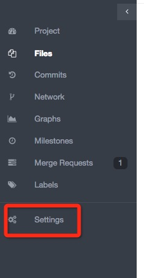

# 标准codereview流程

## 先决条件

gitlab的codereview是建立在权限管理的基础上，在gitlab将一个项目的master分支设置为protected，即可以保护该分支，使得除了master级别及其以上权限的负责人可以推送到远程master分支，而别的开发者由于没有权限，在开发完后，只有通过merge-request向负责人发起codereview,通过后由负责人merge到master分支，随后发布qa。

设置保护分支的流程：

    

##  1）业务codereview
	
####    原则：master分支设为保护分支，除了master级别及其以上权限都不能进行修改

####    流程：业务开发人员在自己的分支上开发，当一个feature开发完毕push到远程服务器

*   在feature提交后，登录http://gitlab.beisen.co/,点击merge request发起codereview请求

*   选择merge源和目的（master），点击compare code进入merge request编辑状态

*	在编辑状态中填写此次提交的feature完成的功能，选择指派给谁进行code review，设置完毕后提交

*	codereview人员收到此次review任务后，打开merge requests，打开该code review，在changes中对code添加评语

*	如果该feature满足要求，则接受该merge请求，否则通过沟通让开发人员进行修改提交，在此merge request中继续codereview。

*	如果需要修改merge request信息，则edit

*	如果需要废弃该请求，直接close

## 2）组件codereview

####    原则：由组件维护者衡量是否进行merge，开发者需要先fork，在自己的项目中完成开发，随后向维护者发送merge request

####    流程：开发人员在自己的项目中开发，当一个feature开发完毕push到远程服务器

*   在修改提交后，登录http://gitlab.beisen.co/,点击merge request发起codereview请求

*   选择merge源和目的（master），点击compare code进入merge request编辑状态

*	在编辑状态中填写此次提交的feature完成的功能，选择指派给谁进行code review，设置完毕后提交

*	codereview人员收到此次review任务后，打开merge requests，打开该code review，在changes中对code添加评语

*	如果该feature满足要求，则接受该merge请求，否则通过沟通让开发人员进行修改提交，在此merge request中继续codereview。

*	如果需要修改merge request信息，则edit

*	如果需要废弃该请求，直接close