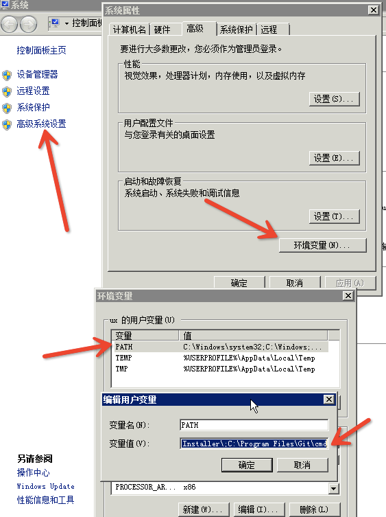
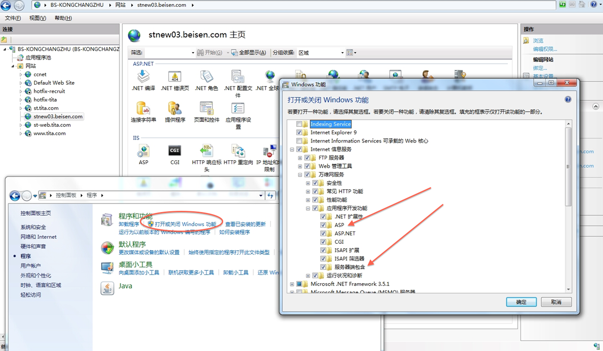

#环境搭建

##版本管理：TortoiseSVN

下载：http://ux.beisen.co/redmine/attachments/download/46/TortoiseSVN-1.7.13.24257-x64-svn-1.7.10.msi

##Git配置

请参阅：http://ux.beisen.co/redmine/projects/ux-infrastructure/wiki/Git%E5%8F%8A%E9%85%8D%E7%BD%AE

##编辑器：Sublime Text 2

* 下载：http://ux.beisen.co/redmine/attachments/download/48/Sublime%20Text%202.0.2%20x64%20Setup.exe

* 安装Package Control（插件管理器）：通过ctrl+` 快捷键或 View > Show Console 菜单打开Sublime Text的控制台，并输入以下代码：

	```
import urllib2,os,hashlib; h = '7183a2d3e96f11eeadd761d777e62404' + 'e330c659d4bb41d3bdf022e94cab3cd0'; pf = 'Package Control.sublime-package'; ipp = sublime.installed_packages_path(); os.makedirs( ipp ) if not os.path.exists(ipp) else None; urllib2.install_opener( urllib2.build_opener( urllib2.ProxyHandler()) ); by = urllib2.urlopen( 'http://sublime.wbond.net/' + pf.replace(' ', '%20')).read(); dh = hashlib.sha256(by).hexdigest(); open( os.path.join( ipp, pf), 'wb' ).write(by) if dh == h else None; print('Error validating download (got %s instead of %s), please try manual install' % (dh, h) if dh != h else 'Please restart Sublime Text to finish installation')
	```

详情请见：https://sublime.wbond.net/installation#st2

##构建工具

* 安装nodejs: http://ux.beisen.co/redmine/attachments/download/77/node-v0.10.29-x64.msi

* 安装完nodejs后，在控制台cmd中执行以下代码，安装grunt和bower：

	```
	npm -g install grunt-cli bower
	```

	* 安装Ruby: http://ux.beisen.co/redmine/attachments/download/50/rubyinstaller-1.9.3-p448.exe

	* 安装完Ruby后，在控制台cmd中执行以下代码，安装sass、compass：

	###compass 安装

	#### 1、安装ruby

	因为compass、sass依赖于ruby环境，所以装sass之前先确认装了ruby。先到官网下载个ruby
	在安装的时候，请勾选Add Ruby executables to your PATH这个选项，添加环境变量，不然以后使用编译软件的时候会提示找不到ruby环境

	* 如果用npm安装grunt和bower时，报错，请确认环境变量PATH中已经有node的安装路径。
	* 如果用gem安装compass时，报错，请确认环境变量PATH中已经有ruby的安装路径。

	;

	####2、安装compass

	安装完ruby之后，在开始菜单中，找到刚才我们安装的ruby，打开Start Command Prompt with Ruby

	然后直接在命令行中输入

	```
	gem install sass compass
	```

	这样安装的是最新版本的sass和compass

	按回车键确认，等待一段时间就会提示你sass安装成功。

	若要安装特定版本的compass，在命令行中输入

	```
	gem install  compass -v 0.12.6
	```

	tita在Windows下用的是0.12.6，在Mac下用的是0.12.2。高版本的grunt compass无法完成。

	最近因为墙的比较厉害，如果你没有安装成功，那么请参考下面的淘宝的RubyGems镜像安装sass，如果成功则忽略。

	####淘宝RubyGems镜像安装 sass、compass

	由于国内网络原因（你懂的），导致 rubygems.org 存放在 Amazon S3 上面的资源文件间歇性连接失败。这时候我们可以通过gem sources命令来配置源，先移除默认的https://rubygems.org
	源，然后添加淘宝的源https://ruby.taobao.org/
	，然后查看下当前使用的源是哪个，如果是淘宝的，则表示可以输入compass安装命令gem install compass了.
	
	```
	$ gem sources --remove https://rubygems.org/
	$ gem sources -a https://ruby.taobao.org/
	$ gem sources -l
	*** CURRENT SOURCES ***

	https://ruby.taobao.org
	# 请确保只有 ruby.taobao.org
	$ gem install compass -v 0.12.6
	```

##抓包工具：Fiddler

下载：http://ux.beisen.co/redmine/attachments/download/52/fiddler2setup.exe

##Web Server: IIS

* 开启IIS和相应组件（截图中红色箭头指向的两个模块）；
* 安装Url Rewrite组件：http://ux.beisen.co/redmine/attachments/download/21/rewrite_2.0_rtw_x64.msi

;

##获取代码

###以招聘为例

* 1、从SVN迁出最新代码到本地，如：d:\tms-recruit。
	http://ux.beisen.co/svn/tms-recruit/trunk
* 2、配置站点（如: stnew03.beisen.com），并将物理路径指向d:\tms-recruit\app (项目目录中的app子目录)
* 3、将域名添加到本地Hosts文件： 127.0.0.1 stnew03.beisen.com
* 4、打开控制台（cmd），并切换目录到项目文件夹d:\tms-recruit；
* 5、双击watch.bat，编译HTML模板，并监控文件变更。
* 6、访问tms.beisen.com，修改代码，查看效果！

###对于tita

步骤同上，对应的地址如下：

* svn：http://ux.beisen.co/svn/tita-v4/trunk
* 静态域名：st-web.tita.com
* web站点：www.tita.com