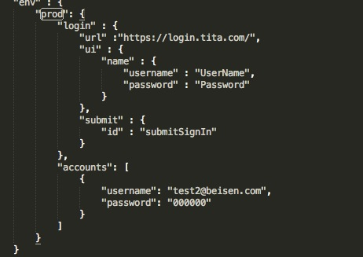

# 使用

------

## 结构

#### 示例


#### 在package.json的env里面添加prod(线上)
#### prod中定义了：

#### 1）login：登录信息

* url: 登录界面地址
* ui: 登录界面的节点信息

 ````
 name:
 	username：用户名input标签name属性值
	password：用户密码input标签的name属性值账户
 class:(待扩展)
 	username：用户名input标签classname属性值
	password：用户密码input标签的classname属性值账户
````

 * submit:提交

````

id：提交按钮的id

````

#### 2）accounts：测试账户
* username：测试账户名
* password：测试账户密码


