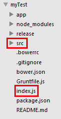

# 组件封装规范

------

## 1）组件的文件夹结构是什么样的？
#### 组件的文件结构对比业务的文件结构

#### 可知业务组件多了` src `文件夹和index.js文件。


## 2）组件功能演示代码放在哪里？源码放在哪里？
#### 组件功能演示代码放在home/index-page-view.js里，源码放在`src`文件夹里面。


## 3）为什么要生成两个index.js？
#### 在业务组件中
#### 
#### 多出了两个index.js 
 > * vendor/components/cutpic/index.js 是为了模仿用户行为（从bower中直接下载组件）。
##### 模仿用户行为指模仿业务开发时引用组件。过程如下图：
 
##### 

 > * 而下面的index.js是真正提供给用户用的。


## 4）Grunt插件preprocess的作用；
#### 在Gruntfile.js里面添加了preprocess插件：
````
,preprocess: {
			build: {
				src: [
					'src/index.js'
				],
				dest: 'app/scripts/vendor/components/cutpic/index.js'
			}
			,dist: {
				src: [
					'src/index.js'
				],
				dest: 'index.js'
			}
		}

````

#### preprocess中定义了两个任务：build、dist。
#### 意思是：将src中的文件编译一份分别放在 app/scripts/vendor/components/cutpic/index.js 和 index.js下。
#### src/index.js的内容如下：
````
define(['talent'],function(talent) {
	
	// @include scripts/jquery.Jcrop.js
	// @include scripts/cutpic-view.js

	return itemView;
})

````

## 5）如何处理组件所依赖的第三方库或组件？
#### 有两种情况：
 > * 组件依赖的第三方可以直接被使用或被其他组件所依赖
##### 将第三方库先作为一个组件放入bower中，在组件需要用时，同业务开发一样使用。 

 > * 组件依赖的第三方只有此组件会使用
##### 将第三方库的代码直接加入组件当中。
##### 例如：头像剪裁组件依赖的jquery.Jcrop第三方库，该库不能被独立使用或被其他组件依赖，故将其通过 @include scripts/jquery.Jcrop.js 进行引入，见下图所示：
##### 