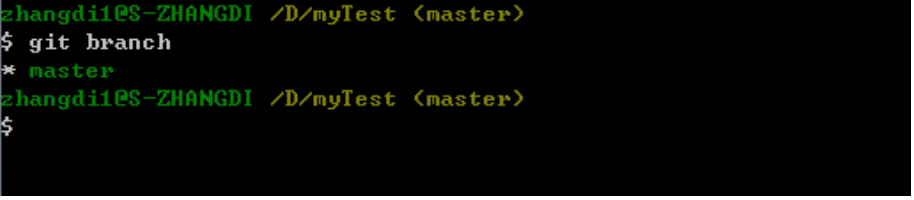
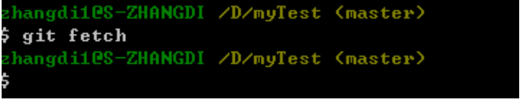
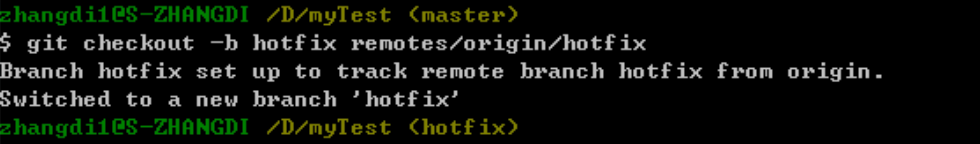
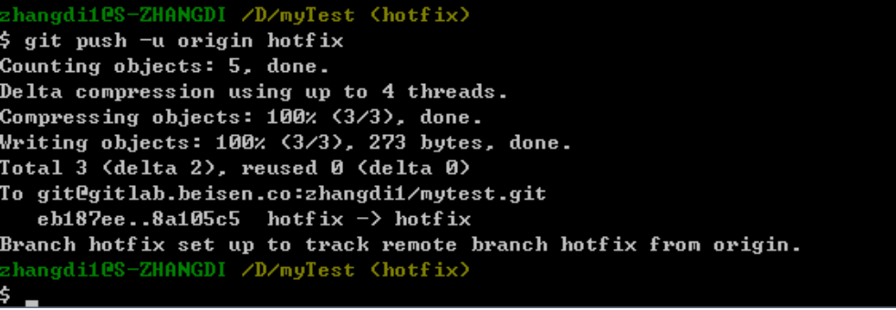
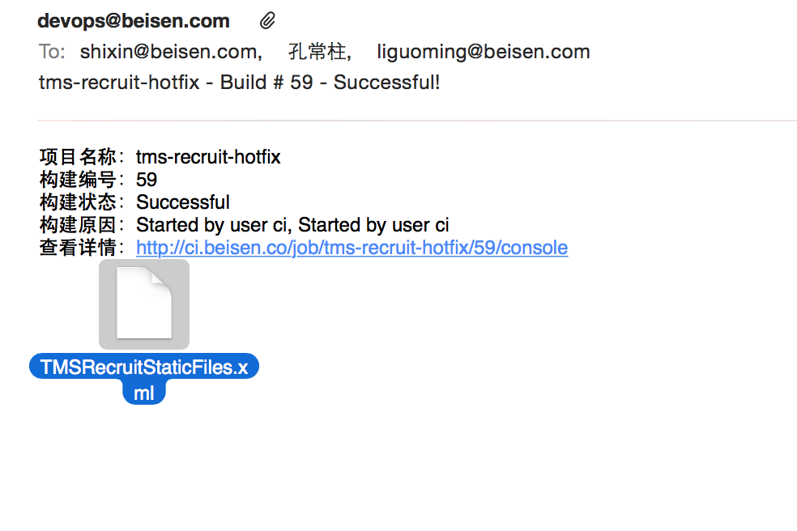
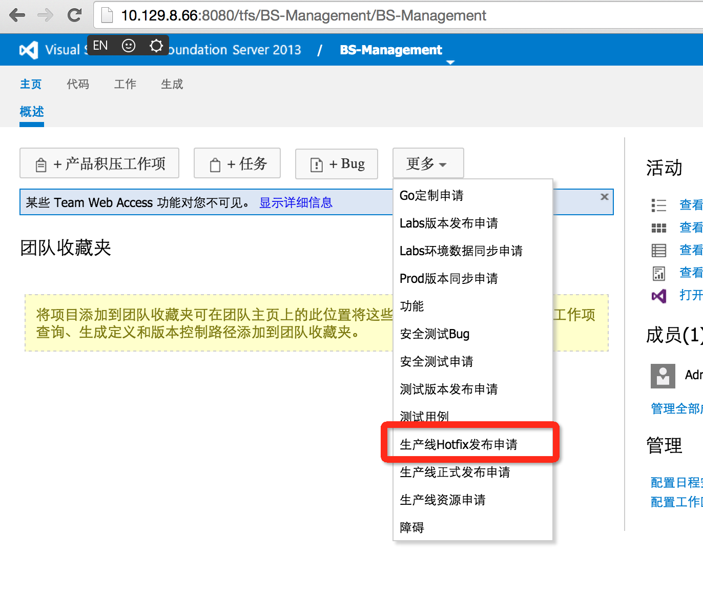
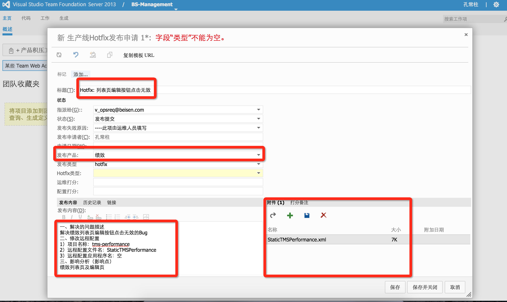
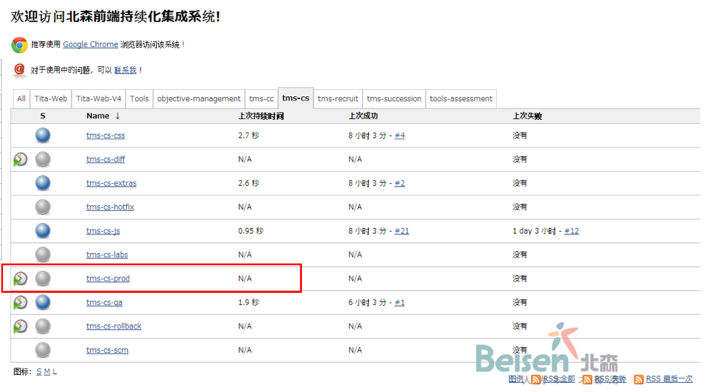
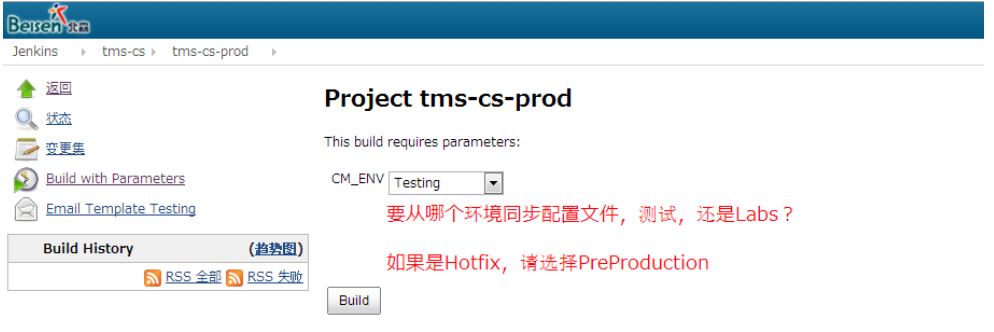

# 前端项目hotfix操作文档

## 标准操作流程

* 查看本地是否有hotfix分支，执行`git branch`；

* 如果没有hotfix分支，执行`git fetch` ；

* 创建新的hotfix分支，执行`git checkout -b hotfix remotes/origin/hotfix`；

* 在hotfix分支中进行修改、提交，执行`git push -u origin hotfix`，
再次提交可直接执行`git push`；

## 本地已经存在hotfix分支时
* 切换到hotfix分支，执行`git checkout hotfix`；
* 从远程库获取更新代码，执行`git pull`；
* 如若上一步有太多冲突，可以删除hotfix分支，执行`git branch -d hotfix`，然后再执行标准操作流程；

## hotfix后的上线 - 提交申请给运维部署上线
* 代码提交到hotfx分支后，会收到如图所示的邮件，附件中有hotfix后的配置文件。
 
* 访问TFS：http://10.129.8.66:8080/tfs/BS-Management/BS-Management   （如果没有权限，请联系康燕燕开通）
 
* 填写申请，并将配置文件作为附件上传。

> 一、解决的问题描述  
> 解决绩效列表页编辑按钮点击无效的Bug  
> 二、修改远程配置  
> 1）项目名称：tms-performance（package.json中的name字段） 
> 2）远程配置文件名：StaticTMSPerformance （package.json中的configFile字段）  
> 3）远程配置应用程序名：空 （package.json中的configApp字段）  
> 三、影响分析（影响点） 
> 绩效列表页及编辑页  

 

* 申请提交后，运维会收到邮件，处理后，会回复邮件给申请人。

## hotfix后的上线 - 有自行上线权限
* 登陆http://ci.beisen.co 看到以下页面：	
* 点击后缀为-prod的任务前面的小圆圈，会直接跳到下页面；

* 选择PreProduction ，点击Build即可部署到线上；

## 注意
==hotfix上线前，一定要通过Fiddler先在本地验证配置文件的正确性。==
